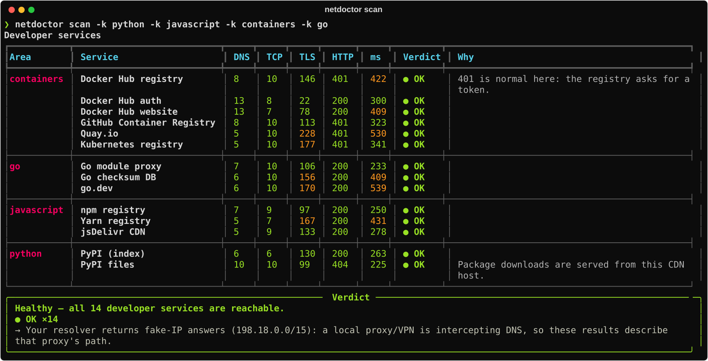
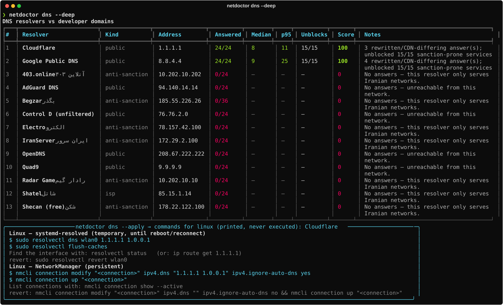
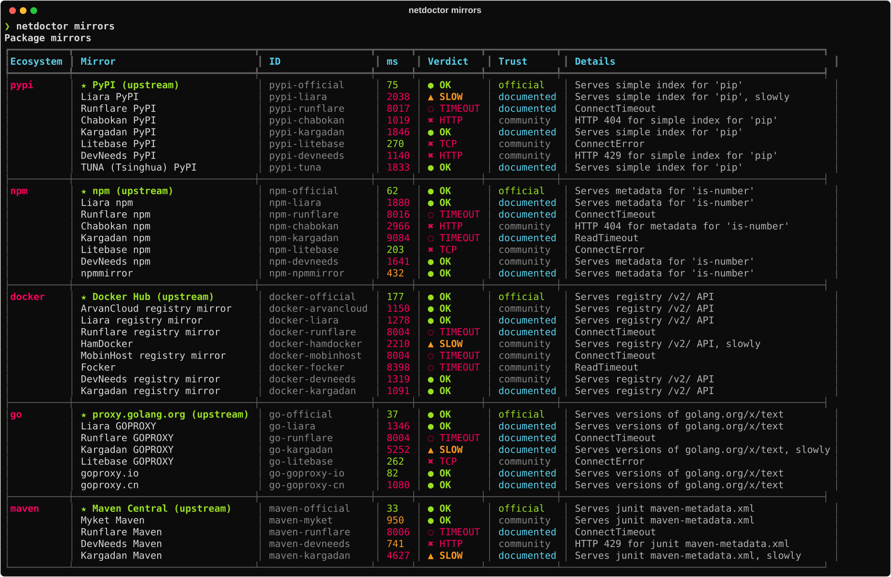
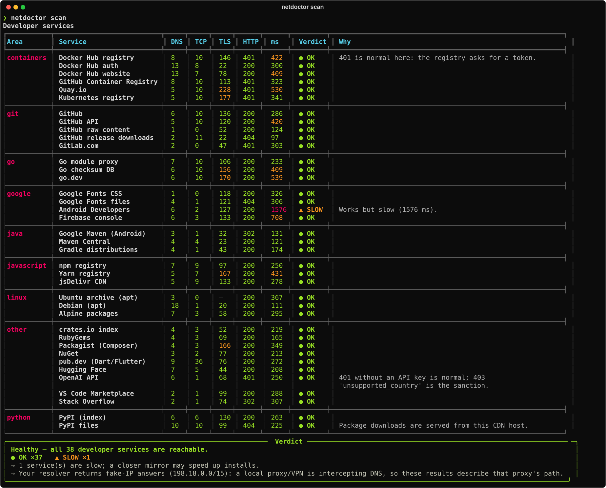

<div align="center">

# netdoctor-ir

**A connectivity doctor and mirror switcher for developers in Iran.**
Find out in 30 seconds *why* `pip install`, `npm install`, `docker pull` or `go get` is failing:
DNS hijack, SNI filtering, or a sanction page. Then see which DNS resolver and which package mirror works *today*, and switch to it without losing your old config.

[](https://github.com/mrzroot/netdoctor-ir/actions/workflows/ci.yml)
[](LICENSE)
[](pyproject.toml)

[Website](https://mrzroot.github.io/netdoctor-ir/) · [Quick start](#quick-start) · [How it works](#how-it-works) · [Contribute a mirror](#contributing-to-the-catalogs) · [FAQ](#faq) · [فارسی](#فارسی)



<sub>Real output, captured on 2026-10-08 on a build server <b>outside Iran</b>. That's why everything is green.
On an Iranian connection you'd see rows such as <code>⊘ SANCTIONED</code> (Docker Hub export-control page) or <code>✖ FILTERED</code> (TLS reset after TCP connect).</sub>

</div>

---

## Why

If you write software in Iran, you lose hours every month to the same questions:

- Is PyPI down, or is it my DNS? Why does `docker pull` return **403**?
- Which anti-sanction DNS works today: Shecan, 403.online, Begzar, Electro, Radar?
- Which Iranian PyPI / npm / Docker / Go mirror is up right now, and how do I point my tools at it?
- I changed `pip.conf` last month. What did it say before?

`netdoctor` answers those questions with measurements, not guesses.

## Features

| Command | What it does |
|---|---|
| `netdoctor scan` | Probes **38 developer services** (PyPI, npm, Docker Hub, GHCR, Go proxy, GitHub, GitLab, Google Fonts, Google Maven, Maven Central, apt, crates.io, Hugging Face, the OpenAI API, …) concurrently through **DNS → TCP → TLS → HTTP**. Each one gets a verdict: `OK`, `SLOW`, `SANCTIONED`, `FILTERED`, `FORBIDDEN`, or a DNS/TCP/TLS/HTTP error with a plain-language reason. A summary at the end tells you what to do next. |
| `netdoctor dns` | Benchmarks **13 resolvers** (public plus Iranian anti-sanction and ISP resolvers) on developer domains with `dnspython`, then ranks them by success rate and latency. It also counts hijacked answers (`10.10.34.x`) and rewritten answers. `--deep` fetches the sanction-prone services through each resolver's answers, so you can see which resolver actually unblocks Docker Hub. `--apply` prints the commands for your OS. It never runs them. |
| `netdoctor mirrors` | Checks **37 mirrors** (PyPI, npm, Docker registry, GOPROXY, Maven) by downloading a real artefact from each and checking the content, not just the status code. `--write` updates `pip.conf`, `.npmrc`, Docker `daemon.json` and Go's `GOPROXY`, shows a diff first, and keeps an **automatic backup**. |
| `netdoctor restore` | Puts back every file the last `--write` touched, and removes files that didn't exist before. Use `--list` to see all backups. |
| `netdoctor report` | Writes a shareable `--json` and/or `--md` report (scan + DNS + mirrors) that you can paste into an issue or a team chat. It doesn't include your IP address. |
| `netdoctor tui` | Optional live dashboard built with [Textual](https://textual.textualize.io/), with auto-refresh (`pip install 'netdoctor-ir[tui]'`). |
| `netdoctor catalog` | `list` / `validate` the data catalogs. Contributors and CI use it. |

More details:

- **Fast:** everything runs on `asyncio` with bounded concurrency. A full scan usually finishes in a few seconds.
- **Explains failures, not just "failed":** for example, *"TLS handshake reset after TCP connect — typical of SNI filtering"*, *"DNS answered 10.10.34.35 — Iranian national filtering redirect"*, or *"HTTP 403: Docker Hub export-control block"*.
- **Tests what your tool would see:** with `--resolver shecan`, the HTTP request goes to the IP that resolver returned, with the original Host header and TLS SNI. That's the same path `pip` or `docker` would take with that DNS.
- **Safe by default:** no root, no system changes, no telemetry. Config writes are opt-in, diffed, backed up and reversible.
- **Data-driven:** resolvers, mirrors, services and sanction signatures live in plain YAML under [`netdoctor/data/`](netdoctor/data). Every entry carries a trust level: `official`, `documented` or `community-reported`.

## Quick start

```bash
# Recommended: an isolated install with pipx
pipx install git+https://github.com/mrzroot/netdoctor-ir.git

# …or install the wheel attached to the latest GitHub release
pipx install https://github.com/mrzroot/netdoctor-ir/releases/download/v0.1.0/netdoctor_ir-0.1.0-py3-none-any.whl

netdoctor scan                 # what works, what doesn't, and why
netdoctor dns --deep           # which resolver is fastest, and which actually unblocks things
netdoctor mirrors              # which mirror is up right now
netdoctor mirrors --write      # switch pip/npm/Docker/Go to the best mirrors (with backup)
netdoctor restore              # undo
```

> netdoctor is **not on PyPI yet**. Install it from GitHub as shown above. Python 3.10+ is required.

### More examples

```bash
netdoctor scan -k containers,go                # only some categories
netdoctor scan --resolver shecan               # "would Shecan fix my problems?"
netdoctor scan --resolver 178.22.122.100 --json > scan.json
netdoctor scan --strict                        # exit 1 if anything is broken (for CI)

netdoctor dns --kind anti-sanction             # just the Iranian anti-sanction resolvers
netdoctor dns --apply --os windows -i "Wi-Fi"  # PowerShell commands for the top resolver
netdoctor dns --apply --use begzar --script switch-dns.sh   # saved for review, not run

netdoctor mirrors -e pypi,npm
netdoctor mirrors --write --dry-run                          # show the diff only
netdoctor mirrors --write --use pypi=pypi-runflare --use docker=docker-arvancloud

netdoctor report --md report.md --json report.json
```

## Screenshots

All of these are **real** output from `scripts/make_screenshots.py`, captured on the build machine (outside Iran, behind a fake-IP egress proxy; the scan says so itself).

<details>
<summary><b>netdoctor dns --deep</b>: resolver ranking + <code>--apply</code> commands</summary>



From outside Iran, the Iranian resolvers don't answer at all, which is expected: they serve Iranian networks only. Inside Iran, the "Unblocks" column is the one to watch.
</details>

<details>
<summary><b>netdoctor mirrors</b>: content-verified mirror health with trust levels</summary>



Many Iranian mirrors refuse or rate-limit foreign clients, so from the build server they show up as timeouts or 429s. From inside Iran the picture is different. Run it yourself.
</details>

<details>
<summary><b>netdoctor scan</b>: the full 38-service table</summary>


</details>

## How it works

```
             ┌──────────── for each service, concurrently ────────────┐
 catalog ──► │ DNS (dnspython) → TCP connect → TLS (SNI) → HTTP GET   │ ──► classify ──► verdict + advice
  (YAML)     │  hijack check     timeout?       reset?      body/hdrs  │      (pure functions,
             └────────────────────────────────────────────────────────┘       fully unit-tested)
```

| Symptom observed | Verdict | Meaning |
|---|---|---|
| A record in `10.10.34.0/24` (or loopback / null route) | `FILTERED` | DNS-level filtering redirect |
| TCP connects, then the TLS handshake is reset or stalls | `FILTERED` | Typical SNI-based filtering |
| Certificate doesn't verify | `FILTERED` | Possible TLS interception |
| HTTP body/redirect matches a block page (`peyvandha.ir`, …) | `FILTERED` | National block page |
| HTTP 403/451 + a known sanction marker (Docker export control, Google *"your client does not have permission"*, OpenAI `unsupported_country_region_territory`, Cloudflare 1009, CloudFront geo-block, GitLab embargo, …) | `SANCTIONED` | The service refuses Iranian IPs |
| HTTP 403/451 without a known marker | `FORBIDDEN` | Probably a geo-block; please add the signature |
| Cloudflare bot challenge (`cf-mitigated: challenge`) | `OK` | Reachable; it just wants a browser |
| Expected status but slow | `SLOW` | Works, but a closer mirror would help |

**DNS ranking.** Every resolver address is asked for every domain. Score = `100 × success rate − latency penalty (≤ 30)`. With `--deep`, the score becomes `0.7 × base + 30 × (unblocked ÷ tested)`, so a resolver that actually un-sanctions Docker Hub beats one that is only fast. Answers in a different /16 than the reference resolver (Cloudflare by default) are counted as *rewritten*. Anti-sanction resolvers do that on purpose, though geo-aware CDNs can do it too.

**Mirror checks** fetch something real: the `pip` page of a PEP 503 simple index, npm metadata for `is-number`, the registry `/v2/` endpoint, the Go module list for `golang.org/x/text`, and `junit` metadata from Maven. A mirror that returns its own landing page with HTTP 200 is reported as broken, not as healthy.

**Config writing** edits only the relevant key and keeps your comments and other settings:

| Tool | File | Key |
|---|---|---|
| pip | `~/.config/pip/pip.conf` (Linux), `~/Library/Application Support/pip/pip.conf` if present (macOS), `%APPDATA%\pip\pip.ini` (Windows); honours `PIP_CONFIG_FILE` | `[global] index-url` |
| npm | `~/.npmrc` (honours `NPM_CONFIG_USERCONFIG`) | `registry` |
| Go | Go's env file, the same one `go env -w` writes (honours `GOENV`) | `GOPROXY=<mirror>,direct` |
| Docker | `~/.docker/daemon.json` (Docker Desktop). On Linux, a staged copy in `~/.netdoctor/out/` plus the `sudo cp` command, so netdoctor never needs root. | `registry-mirrors` (prepended) |

Backups live in `~/.netdoctor/backups/<timestamp>/` with a `manifest.json` (override with `NETDOCTOR_HOME`).

### Project layout

```
netdoctor/
  cli.py        Typer CLI (scan, dns, mirrors, restore, report, tui, catalog)
  net.py        the only module doing I/O: dnspython, asyncio sockets, httpx
  scanner.py    probe chain + classify() + summarize()
  detect.py     pure heuristics: block ranges, signatures, explanations
  dnsbench.py   resolver benchmark, deep unlock check, ranking
  mirrors.py    content-verified mirror probes
  configs.py    pip/npm/Docker/Go planners (diffs) and writer
  backup.py     backup sets + restore
  osapply.py    per-OS DNS instructions / scripts (never executed)
  report.py     JSON + Markdown reports
  render.py     Rich tables & panels (width-aware)
  tui.py        optional Textual dashboard
  data/*.yaml   services, resolvers, mirrors, signatures
```

## Contributing to the catalogs

The catalogs are the heart of the project, and the easiest way to help. Mirrors come and go, resolvers change IPs, and sanction pages change wording.

1. Edit the right file in [`netdoctor/data/`](netdoctor/data):
   - `mirrors.yaml`: `id`, `name`, `provider`, `ecosystem` (`pypi|npm|docker|go|maven`), `url`, `verification`, `source`
   - `resolvers.yaml`: `id`, `name`, `name_fa`, `kind` (`public|anti-sanction|isp`), `addresses`, `iran_only`, `verification`
   - `signatures.yaml`: a sanction or block page fingerprint (`kind`, `patterns`, optional `statuses`)
   - `services.yaml`: a developer service worth probing (`host`, a lightweight `path`, `expect`ed statuses)
2. Set `verification` honestly:
   - `official`: run by the upstream project itself
   - `documented`: the operator lists this exact endpoint on its own site or docs (link it in `source`)
   - `community-reported`: found on a community list; not yet confirmed from inside Iran
3. Validate and test locally:
   ```bash
   netdoctor --catalog-dir netdoctor/data catalog validate
   netdoctor mirrors -o your-new-id
   ```
4. Open a PR. CI validates the catalogs automatically. Output from `netdoctor mirrors -o <id>` run **inside Iran** is the best evidence for upgrading an entry to `documented`.

You can also keep a private catalog: point `--catalog-dir` (or `NETDOCTOR_CATALOG_DIR`) at a folder, and any YAML file in it replaces the bundled one.

The initial mirror catalog (October 2026) was compiled from the [Mirava](https://github.com/MiravaOrg/Mirava) list, the [mirrors.arash-hatami.ir](https://mirrors.arash-hatami.ir/) directory and operators' own documentation pages. Thanks to their maintainers.

## Development

```bash
git clone https://github.com/mrzroot/netdoctor-ir && cd netdoctor-ir
python -m venv .venv && . .venv/bin/activate
pip install -e '.[dev,tui]'
ruff check . && ruff format --check . && mypy netdoctor
pytest --cov                     # no test touches the internet
```

See [CONTRIBUTING.md](CONTRIBUTING.md). The test suite (169 tests, ~98% line+branch coverage) uses a scripted fake network, `respx` for HTTP, and loopback sockets. It never makes real external requests.

## FAQ

**Does netdoctor bypass filtering or sanctions?**
No. It's a diagnostic tool. It measures reachability and, if you ask, points your package managers at mirrors and prints DNS settings. It doesn't tunnel, proxy or encrypt anything, and it isn't a VPN.

**Why is everything green in the screenshots?**
They were captured on a build server outside Iran. That's also why every Iranian resolver shows `0/24`: those resolvers only answer clients on Iranian networks. Run netdoctor on your own connection to see your real picture.

**Will it change my system DNS?**
Never automatically. `netdoctor dns --apply` prints the commands (and `--script` saves them) so you can review and run them yourself, usually with admin rights.

**Why didn't `mirrors --write` change anything?**
If the upstream registry is the fastest healthy option, netdoctor leaves that tool alone. To choose a mirror explicitly, use `--use pypi=<mirror-id>`.

**Is a `community-reported` mirror safe?**
It means nobody has confirmed the entry from inside Iran yet. Mirrors can see which packages you download. Prefer `official` and `documented` entries, and check package hashes (`pip --require-hashes`, lockfiles) when you use any mirror.

**Does it send telemetry?**
No. The only network traffic goes to the services, resolvers and mirrors in the catalog. Reports don't contain your IP address.

**Windows / macOS?**
Yes. The core is pure Python. DNS instructions and config paths cover Linux, macOS and Windows.

## Disclaimer

netdoctor-ir is an independent, open-source **diagnostic** tool. It respects the law. It doesn't bypass, tunnel around or defeat any filtering or sanction mechanism by itself. It measures connectivity and helps you configure publicly offered mirrors and DNS resolvers that you choose to use. You're responsible for complying with the laws and terms of service that apply to you. Third-party resolvers and mirrors in the catalog are listed for convenience. They aren't endorsed, and their availability and behaviour can change at any time.

---

## فارسی

<div dir="rtl">

### netdoctor-ir چیست؟

**netdoctor** ابزاری خط‌فرمانی برای برنامه‌نویس‌های داخل ایران است. با آن می‌فهمید چرا `pip install`، `npm install`، `docker pull` یا `go get` کار نمی‌کند: DNS دستکاری شده، فیلترینگ روی SNI است، یا خود سرویس به‌خاطر تحریم خطای ۴۰۳ برمی‌گرداند. بعد نشان می‌دهد **امروز** کدام DNS و کدام میرور واقعاً کار می‌کند.

### امکانات

- **`netdoctor scan`**: ۳۸ سرویس پرکاربرد توسعه (PyPI، npm، Docker Hub، Go proxy، گیت‌هاب، گیت‌لب، Google Fonts، Google Maven، Maven Central، apt و…) را هم‌زمان در چهار مرحلهٔ DNS، TCP، TLS و HTTP بررسی می‌کند. برای هر سرویس حکم و دلیل را به زبان ساده می‌گوید، مثلاً «تحریم: صفحهٔ export control داکر» یا «فیلتر: قطع اتصال TLS بعد از برقراری TCP».
- **`netdoctor dns`**: سرعت و درستی پاسخ DNSهای عمومی و ضدتحریم ایرانی (شکن، ۴۰۳، بگذر، الکترو، رادار گیم و…) را روی دامنه‌های برنامه‌نویسی می‌سنجد و آن‌ها را رتبه‌بندی می‌کند. با `--deep` معلوم می‌شود کدام DNS واقعاً تحریم Docker Hub و بقیه را رفع می‌کند. با `--apply` فقط دستورهای مخصوص سیستم‌عامل شما **چاپ می‌شود**. netdoctor هیچ تنظیمی را خودش تغییر نمی‌دهد و دسترسی root هم لازم ندارد.
- **`netdoctor mirrors`**: میرورهای PyPI، npm، Docker، Go و Maven را با دانلود یک فایل واقعی و بررسی محتوای آن آزمایش می‌کند. با `--write` تنظیمات pip، npm، Docker و `GOPROXY` را به بهترین میرور تغییر می‌دهد. قبل از نوشتن، تغییرات را نشان می‌دهد و **خودکار پشتیبان می‌گیرد**.
- **`netdoctor restore`**: آخرین تغییرات را دقیقاً به حالت قبل برمی‌گرداند.
- **`netdoctor report --md/--json`**: گزارشی قابل‌اشتراک می‌سازد که IP شما در آن نیست.
- **`netdoctor tui`**: داشبورد زنده (اختیاری).

### شروع سریع

</div>

```bash
pipx install git+https://github.com/mrzroot/netdoctor-ir.git
netdoctor scan
netdoctor dns --deep
netdoctor mirrors --write   # با پشتیبان‌گیری خودکار؛ برای برگرداندن: netdoctor restore
```

<div dir="rtl">

### مشارکت

فهرست DNSها، میرورها و امضای صفحه‌های تحریم در فایل‌های YAML پوشهٔ `netdoctor/data` نگه‌داری می‌شود. اگر میرور تازه‌ای می‌شناسید یا آدرسی عوض شده، یک Pull Request بفرستید. هر مورد یک سطح اعتماد دارد: `official` (خود پروژهٔ اصلی)، `documented` (اپراتور در سایت یا مستندات خودش منتشر کرده) یا `community-reported` (از فهرست‌های عمومی آمده و هنوز از داخل ایران تأیید نشده). خروجی `netdoctor mirrors -o <id>` که **از داخل ایران** گرفته شده باشد بهترین مدرک برای تأیید یک مورد است.

### سلب مسئولیت

این ابزار فقط **تشخیصی** است و به قانون احترام می‌گذارد. خودش هیچ فیلترینگ یا تحریمی را دور نمی‌زند، تونل یا پروکسی نمی‌سازد و VPN نیست. فقط اتصال را اندازه می‌گیرد و در صورت درخواست شما، ابزارهای توسعه را روی میرورها و DNSهای عمومی‌ای تنظیم می‌کند که خودتان انتخاب کرده‌اید. رعایت قوانین و شرایط استفاده بر عهدهٔ کاربر است.

> تصاویر این صفحه خروجی واقعی برنامه‌اند، ولی روی سروری **خارج از ایران** گرفته شده‌اند. برای همین همه‌چیز سبز است و DNSهای ایرانی پاسخی نداده‌اند. برای دیدن وضعیت واقعی اینترنت خودتان، برنامه را روی سیستم خودتان اجرا کنید.

</div>

---

<div align="center">
<sub>MIT © 2026 <a href="https://github.com/mrzroot">Mohammadreza Zare</a> · Built in Mashhad for everyone who has ever stared at <code>403 Forbidden</code> from <code>registry-1.docker.io</code>.</sub>
</div>
